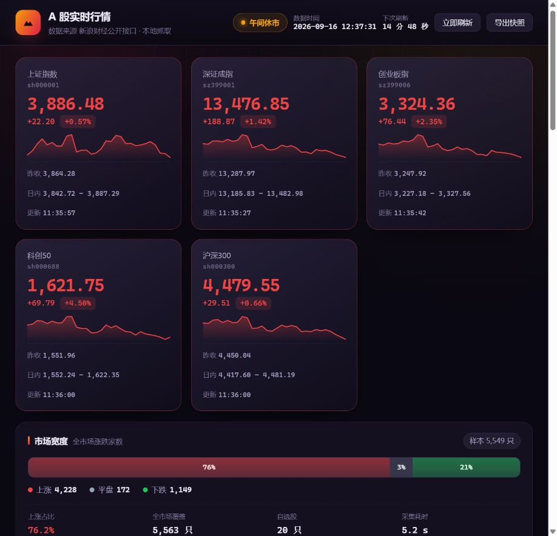

# A 股实时行情 · 本地仪表盘

> **直接从公开行情接口抓数据，在你自己电脑上跑一个 A 股实时看板。**
> 零第三方依赖，双击一个 `start.bat` 就能用；也可以导出成单文件 HTML 离线看或发给别人。



---

## 30 秒上手

**第一步：确认有 Python。** 装了 Anaconda 就有；没有的话去
<https://www.python.org/downloads/> 下载，安装时记得勾选 `Add python.exe to PATH`。

**第二步：双击 `start.bat`。**

浏览器会自动打开 `http://127.0.0.1:8771`，数据自动抓取并持续刷新。
关闭那个黑窗口就是停止服务。

> **不需要 pip install，不需要 API Key，不需要注册任何账号。**
> 整个项目只用 Python 标准库。

> **端口说明**：这个看板用 **8771**，和之前那个美股看板（8770）不冲突，可以同时开着。

---

## 它长什么样

| 区域 | 内容 |
|---|---|
| 顶部状态栏 | 交易状态（交易中／午间休市／集合竞价／已收盘／休市）、数据时间、下次刷新倒计时 |
| 指数主卡 | 上证指数、深证成指、创业板指、科创 50、沪深 300：点位、涨跌、日内区间、昨收、30 日迷你走势 |
| 市场宽度 | 全市场 5500+ 只的涨跌家数比例条 |
| **涨跌停统计** | 涨停／跌停／一字涨停／一字跌停／炸板家数、涨跌停比 |
| 指数走势 | 上证指数日线图，可切 1 月 / 3 月 / 6 月 / 1 年，鼠标悬停看具体数值 |
| 行业板块 | 全部 49 个行业板块的涨跌幅，中轴对称条形图，标注领涨股 |
| 自选股 | 默认 20 只各行业龙头，可自定义 |
| 市场榜单 | 涨幅榜 / 跌幅榜 / 成交额榜 / 换手率榜 |

### 两个必须做对的地方

**红涨绿跌。** 中国股市和美股相反：红色是涨、绿色是跌。
如果照搬美股配色，每一根 K 线都会被读反。这个项目的配色由 CSS 变量
`--up` / `--down` 统一定义，并且有测试守护（`test_store_render.py` 里
`test_standalone_html_uses_red_for_gain`），防止哪天被改回去。

**涨跌停要分板块。** 主板 ±10%、创业板与科创板 ±20%、北交所 ±30%，
主板 ST 股 ±5%。判断"是否涨停"必须先知道这只股票属于哪个板，
而且要考虑交易所的涨跌停价四舍五入到分——实际涨幅常常是 9.97% 或 20.02%，
不能用等号判断。这些规则集中在 `market.py` 里。

---

## 数据是从哪来的

全部是公开行情接口，且都经过实测验证：

| 用途 | 接口 |
|---|---|
| 指数与个股行情 | `hq.sinajs.cn/list=...`（批量，GBK） |
| 全市场分页快照 | `Market_Center.getHQNodeData` |
| 全市场股票数量 | `Market_Center.getHQNodeStockCount` |
| 行业板块 | `newSinaHy.php`（官方行业分类） |
| 指数日线 | `CN_MarketDataService.getKLineData` |

另外也验证过**上交所与深交所官网接口**（`query.sse.com.cn`、`www.szse.cn/api`）
可以正常访问，它们更适合做单市场深度数据，本项目当前没有使用。

几个实现细节值得说明，因为它们决定了"能不能稳定跑"：

**连接复用是性能关键。** 全市场要翻 56 页。如果每次请求都新建连接，
TLS 握手会把整个采集拖到一分钟以上。改成每个工作线程按域名持有一条长连接后，
**完整采集（5563 只 + 5 个指数 + 49 个板块 + 日线）只要 3.7 秒**。

**一次抓全市场，本地算榜单。** 涨跌幅榜、市场宽度、涨跌停统计这三个视图
共用同一份全市场快照。接口本身支持按字段排序，所以不需要本地排序，
也不需要逐只股票去查。

**交易时段用北京时间算，但不读本机时区。** A 股没有夏令时，
按 UTC+8 换算即可；用 UTC 换算而不是读本机时区，换台电脑也不会算错。
节假日通过"行情数据里的日期不是今天"来识别。

**抓取失败不会让页面白屏。** 任何一个数据源失败都会记进 `warnings`，
页面上明确提示哪部分可能不是最新的，而不是悄悄显示空白。

---

## 两种使用形态

### 形态一：本地服务（日常用这个）

```bash
python scripts/serve.py
```

刷新节奏自动切换：

* **盘中**（9:30–11:30、13:00–15:00）：每 60 秒抓一次
* **其他时间**：每 15 分钟抓一次

### 形态二：单文件 HTML 快照（分享或离线用）

```bash
python scripts/export_html.py --refresh
```

生成 `data/exports/ashare-dashboard.html`，样式、脚本、数据全部内联。
双击就能打开，不需要联网、不需要 Python，可以直接发给别人。
页面里也有一键导出按钮。

---

## 让它每天自动更新

```powershell
powershell -ExecutionPolicy Bypass -File scripts\install_task.ps1
```

默认在 A 股交易时段的六个时间点自动抓取并导出快照（北京时间）：
`09:35`、`10:30`、`11:25`、`13:05`、`14:00`、`14:55`。
这样即使你整天没开服务，随时双击 HTML 也能看到最近一次的数据。

删除任务：

```powershell
powershell -ExecutionPolicy Bypass -File scripts\install_task.ps1 -Uninstall
```

---

## 自定义

复制 `.env.example` 为 `.env` 后修改（或直接改环境变量）：

| 变量 | 默认值 | 说明 |
|---|---|---|
| `ASHARE_WATCH_SYMBOLS` | 20 只行业龙头 | 自选股，6 位代码逗号分隔 |
| `ASHARE_WATCH_REFRESH_SECONDS` | `60` | 盘中刷新间隔 |
| `ASHARE_WATCH_IDLE_SECONDS` | `900` | 非交易时段刷新间隔 |
| `ASHARE_WATCH_UNIVERSE_TTL` | `180` | 全市场快照缓存时间（抓一次要翻 56 页，别设太小） |
| `ASHARE_WATCH_WORKERS` | `16` | 并发请求数 |
| `ASHARE_WATCH_PORT` | `8771` | 服务端口 |

只想看几只股票：

```bash
set ASHARE_WATCH_SYMBOLS=600519,300750,000858
python scripts\serve.py
```

---

## 命令行

```bash
python scripts/serve.py                    # 启动仪表盘（默认）
python scripts/fetch_once.py               # 抓一次并打印结果
python scripts/fetch_once.py --export      # 抓取并导出快照
python scripts/export_html.py --refresh    # 导出单文件 HTML

# 或者装成命令后用
pip install -e .
ashare-watch serve
ashare-watch fetch
ashare-watch export
ashare-watch status     # 查看本地快照数与采集日志
```

---

## 项目结构

```
ashare-watch/
├── start.bat                     Windows 双击启动
├── src/ashare_watch/
│   ├── config.py                 配置（环境变量覆盖）
│   ├── models.py                 数据结构
│   ├── structure.py              解析（GBK 文本 / JS 变量 / JSON）
│   ├── market.py                 A 股交易规则：时段、板块、涨跌停
│   ├── client.py                 数据源客户端（连接复用 / 重试 / 缓存 / 并发）
│   ├── derive.py                 榜单 / 市场宽度 / 涨跌停统计
│   ├── collector.py              采集编排
│   ├── store.py                  SQLite：快照历史 + 采集日志
│   ├── render.py                 导出单文件 HTML
│   ├── server.py                 零依赖 HTTP 服务 + 后台定时刷新
│   └── static/                   前端（原生 HTML/CSS/JS，无构建步骤）
├── scripts/                      启动 / 抓取 / 导出 / 注册计划任务
├── tests/                        58 个测试
└── docs/                         预览截图
```

---

## 测试

```bash
pip install -e ".[dev]"
pytest -q
```

58 个测试，覆盖：

* **启动脚本的格式约束**：CRLF 换行、纯 ASCII、候选解释器必须真的执行过、
  结尾必须有 pause（这几条都来自真实故障，见下）
* **A 股交易规则**：午间休市识别、板块判定、涨跌停幅度、一字板、
  涨跌停价的容差处理
* **代码到市场的映射**：`sh000001` 是指数而 `sz000001` 是股票，
  `920xxx` 属于北交所而不是沪市
* 榜单排序、停牌与新股过滤、市场宽度、炸板统计
* 数据源解析（用真实响应片段，离线可跑）
* 单文件 HTML 的内联完整性与 `</script>` 转义
* **红涨绿跌的配色守护**

---

## 启动失败 / 窗口一闪就没了

先绕过批处理，直接在文件夹里按住 `Shift` 右键选「在此处打开 PowerShell 窗口」，
执行：

```bash
python scripts\serve.py
```

这样能看到完整错误。常见情况：

| 现象 | 原因 | 解决 |
|---|---|---|
| 提示 `Python was not found; ... Microsoft Store` | **Windows 自带的假 python.exe**（App Execution Alias），不是真的 Python | 见下 |
| 提示 `python 不是内部或外部命令` | Python 没装或没加进 PATH | 重装并勾选 `Add python.exe to PATH` |
| 提示端口被占用 | 8771 已被占用 | 关掉旧窗口，或 `set ASHARE_WATCH_PORT=8772` |
| 提示 `ModuleNotFoundError` | 在错误的目录下执行 | 先 `cd /d D:\codex\ashare-watch` |

### 关于微软商店的假 Python

Windows 默认在 `AppData\Local\Microsoft\WindowsApps\` 下放了一个 `python.exe`，
它**看起来是 Python，其实只是个跳转链接**：不带参数运行打开微软商店，
带参数运行直接报错退出（退出码 9009）。麻烦的是它在 PATH 最前面，
会把真正的 Python 盖住。

`start.bat` 已经能自动跳过它：脚本会**逐个候选真的执行一次**，
哪个能跑通才用哪个（见 `tests/test_launcher.py` 的守护测试）。
想彻底关掉这个别名：**设置 → 应用 → 高级应用设置 → 应用执行别名**。

---

## 已知限制

1. **用的是公开行情接口，不是官方授权数据。** 接口随时可能调整字段或加限制。
   所有解析都集中在 `structure.py` 与 `client.py`，改起来只动一处。
2. **行情可能有延迟。** 免费接口的部分数据不是逐笔实时，不适合做交易决策依据。
3. **全市场快照有 3 分钟缓存。** 榜单、宽度、涨跌停统计因此最多滞后 3 分钟；
   指数和自选股是实时的。这个缓存是为了避免每 60 秒翻 56 页。
4. **节假日靠数据日期推断。** 没有内置交易日历，休市日会显示"已收盘"并
   标注最近交易日。要精确判断需要接一个交易日历。
5. **没有做历史存档的深度分析。** SQLite 里存了快照，目前只用于"重启后立刻有内容"
   和采集日志，还没有做走势回顾、异动回放。

---

## 声明

数据抓取自公开行情接口，仅供**个人学习与研究**使用。本项目不提供任何投资建议，
行情数据可能存在延迟或错误，请勿作为交易依据。请合理设置刷新频率，
避免对数据源造成不必要的压力。

MIT License

